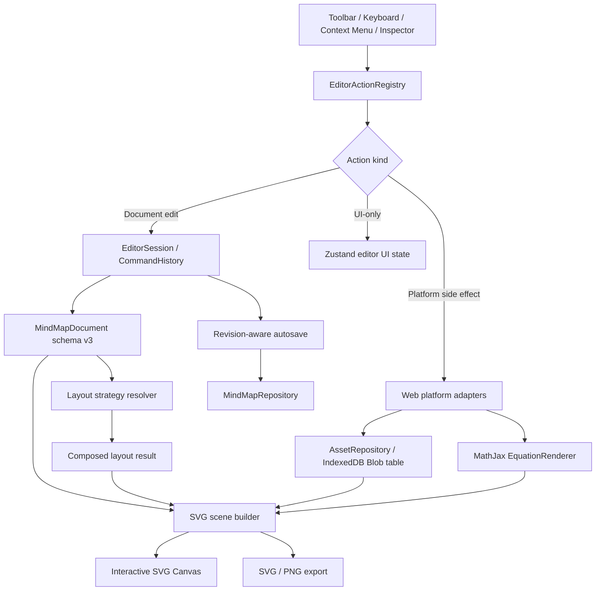

# Web Mind Map Editor V2 技术计划

## 计划摘要

本阶段在现有 Web MVP 上扩展专业思维导图编辑能力，保持 `mindmap-core`、`mindmap-layout`、`mindmap-renderer-svg`、`mindmap-storage`、`mindmap-format` 与 Web 平台层的边界。实现目标不是复制 Xmind，而是在已有本地优先编辑器中完成 `spec.md` 定义的高级结构编辑、Floating Topic、多布局、标签与编号、Callout、图片、公式、细粒度样式、分支聚焦，以及一套可发现、可访问的基础编辑工具栏。

本计划只描述实现路径，不修改产品代码。后续任务应按“先锁定回归与数据格式，再扩展领域能力和布局，最后接入 UI、导出与性能验证”的顺序执行。所有持久化编辑仍必须经过 Command；工具栏、快捷键、右键菜单和 Inspector 只负责发出同一组 Action，不能各自实现不同的业务行为。

## 当前基线

- `packages/mindmap-core` 使用 schema v2，已有单根树、节点文本与基础样式、markers、notes、links、relationships、boundaries、summaries，以及可验证的 Command/undo/redo。
- `packages/mindmap-layout` 目前只有确定性的从左到右树布局，输入为 document 与外部测量的节点尺寸，输出节点、连接线和边界。
- `packages/mindmap-renderer-svg` 已能生成节点、连接线、关系线、边界和概要的纯 SVG scene，并用于 SVG/PNG 导出。
- `packages/mindmap-format` 已支持 schema v1/v2 的解析、迁移、校验和序列化。
- `packages/mindmap-storage` 通过 Dexie 保存完整 document，尚无二进制资源表或资源生命周期接口。
- `apps/web` 已有 `EditorSession`、Zustand UI state、自动保存、键盘映射、Canvas、Inspector、JSON/SVG/PNG 导入导出；当前顶部控件仍以少量按钮为主，没有统一 Action registry 和完整基础编辑工具栏。

## 架构与数据流



### 职责规则

- `MindMapDocument` 与资源 metadata 是持久化内容的唯一事实来源；React component 不直接修改 `nodes`、`childIds`、布局配置或增强对象。
- 文档变更全部通过 `mindmap-core` Command 执行，并生成可逆操作；Action registry 只组合 Command 或调用平台 adapter。
- selection、active menu、filter、branch focus、viewport、drag preview、style clipboard 和 toolbar overflow 属于 Web UI state，不写入 document。
- Layout package 只消费结构化数据和外部提供的尺寸，不读取 DOM，也不负责资源解码或公式排版。
- Renderer package 只消费 layout、document presentation data 和已经解析的可嵌入资源，不调用 IndexedDB、React、Canvas 或文件下载 API。
- 图片 Blob、SVG source 和其他二进制内容由 storage/platform adapter 管理；document 只保存稳定 `assetId` 和展示 metadata。
- JSON 单文件备份使用 bundle envelope；编辑器内部 document schema 与包含 Base64 资源的交换格式分离，避免让大型二进制字符串进入 Command history。

## 受影响的文件与模块

| 区域         | 主要现有文件                                                                                | 计划新增或拆分                                                                                     | 职责变化                                                                                      |
| ------------ | ------------------------------------------------------------------------------------------- | -------------------------------------------------------------------------------------------------- | --------------------------------------------------------------------------------------------- |
| 领域模型     | `packages/mindmap-core/src/model.ts`、`document.ts`、`validation.ts`、`traversal.ts`        | `structure.ts`、`assets.ts`、`annotations.ts`、相关测试 fixture                                    | schema v3、森林所有权、Floating Topic、布局配置、labels、numbering、Callout、内容块与详细样式 |
| Command      | `packages/mindmap-core/src/commands.ts`、`command-executor.ts`、`history.ts`                | 按职责拆分的 structure/content/style/enhancement Command 文件与测试                                | 插入父主题、仅删除当前主题、树与 Floating Topic 转换、布局与样式变更、内容块和批量操作        |
| 格式与迁移   | `packages/mindmap-format/src/schema.ts`、`migration.ts`、`index.ts`                         | bundle schema、asset manifest schema、v2-to-v3 fixtures                                            | 读取 v1/v2/v3，统一迁移到 v3；支持 document-only 与带资源 bundle 的安全导入                   |
| 布局         | `packages/mindmap-layout/src/layout.ts`、`types.ts`、`index.ts`                             | `strategies/logic.ts`、`strategies/balanced.ts`、`strategies/tree.ts`、`compose.ts`、`floating.ts` | 从单一布局升级为策略 registry、子树组合、方向与端口 metadata、Floating Topic 锚点布局         |
| SVG scene    | `packages/mindmap-renderer-svg/src/scene.ts`、`connector.ts`                                | 图片、公式、label、numbering、Callout primitive 与样式序列化测试                                   | 保持纯函数，同时扩展 scene 和确定性导出能力                                                   |
| 存储         | `packages/mindmap-storage/src/repository.ts`、`dexie-repository.ts`、`memory-repository.ts` | `asset-repository.ts`、asset table/memory adapter、事务与垃圾回收测试                              | 分离 document 与 Blob；支持 asset put/get/list/delete、map 删除清理和安全 orphan 回收         |
| Web Action   | `apps/web/src/editor/actions.ts`、`keyboard.ts`、`session.ts`、`store.ts`                   | `action-registry.ts`、`action-state.ts`、`selection.ts`、相关测试                                  | 建立统一 Action ID、可用性、active 状态、disabled reason、快捷键和执行入口                    |
| Web UI       | `apps/web/src/components/editor-shell.tsx`、`mind-map-canvas.tsx`、`topic-inspector.tsx`    | `components/editor-toolbar/*`、context menu、结构/标签/编号/公式/图片面板                          | 新增分组工具栏、overflow、对象选择、branch focus/filter 与详细编辑控件                        |
| Web 平台适配 | `apps/web/src/platform/file-transfer.ts`、`clipboard.ts`                                    | `asset-transfer.ts`、`image-decoder.ts`、`equation-renderer.ts`、安全 SVG 处理                     | 图片选择/粘贴/验证、资源 URL 生命周期、MathJax lazy load、bundle 导入导出                     |
| 样式与 i18n  | `apps/web/src/styles.css`、`apps/web/src/i18n/resources/*.ts`                               | toolbar/menu/action/error 文案                                                                     | 工具栏状态、tooltip、keyboard focus、响应式 overflow 和所有新增错误反馈                       |
| 浏览器验收   | 现有 unit tests 与 E2E 配置                                                                 | `apps/web/e2e/editor-v2*.spec.ts` 及 V2 fixtures                                                   | 覆盖 Action 等价性、布局、资源 round trip、导出、可访问性和 500 节点性能                      |

实际拆分文件名可在任务实施时按现有 package 约定微调，但不能改变上述 ownership。

## 数据模型变更

### schema v3 与迁移

将内部 document 从 schema v2 升级到 schema v3。`mindmap-format` 必须保留 v1 和 v2 输入能力，所有成功解析的数据在进入 editor 前迁移为 v3；新保存和新导出只生成 v3 或包含 v3 document 的 bundle。

迁移要求：

- 保留 map、node 和现有 enhancement ID，不重排已有 `childIds`。
- 为旧 document 补充默认 `structure`、空的 Floating Topic registry、label catalog、asset manifest、map theme 和新样式默认值。
- 旧 root 仍是唯一 main root；所有旧节点保持原 parent/child ownership。
- 旧 relationships、boundaries、summaries 迁移到带显式 style/default placement 的 v3 record，视觉结果尽量与 v2 一致。
- 迁移失败只能返回 typed `FormatError`，不能覆盖或删除本地原数据。

### 文档与森林所有权

```ts
type MindMapStructure =
  'logic-right' | 'logic-left' | 'mind-map-balanced' | 'tree-top' | 'org-top'

interface MindMapDocumentV3 {
  schemaVersion: 3
  rootNodeId: MindMapNodeId
  nodes: Record<MindMapNodeId, MindMapNodeV3>
  floatingTopics: Record<MindMapNodeId, FloatingTopicPlacement>
  defaultStructure: MindMapStructure
  structureOverrides: Record<MindMapNodeId, MindMapStructure>
  labels: Record<LabelId, MindMapLabel>
  assets: Record<AssetId, MindMapAssetMetadata>
  theme: MindMapTheme
  relationships: Record<RelationshipId, MindMapRelationshipV3>
  boundaries: Record<BoundaryId, MindMapBoundaryV3>
  summaries: Record<SummaryId, MindMapSummaryV3>
  callouts: Record<CalloutId, MindMapCallout>
}
```

- `rootNodeId` 继续标识 main root；`floatingTopics` 的 key 是额外根主题。main root 与 Floating Topic 的 `parentId` 都为 `null`。
- 每个 Floating Topic 可以拥有普通子树；其 placement 保存画布坐标与可选结构。坐标是内容空间坐标，不是 viewport 像素。
- 树主题转 Floating Topic 时，Command 从原 parent 的 `childIds` 中移除该节点并写入 placement；Floating Topic 接入树时执行反向操作。
- Validator 要求所有节点恰好从 main root 或一个 Floating Topic 可达，禁止 cycle、多 parent、重复 child、未登记的 null-parent 节点和跨 root 重复所有权。
- 删除 main root 仍被禁止；删除 Floating Topic 按“删除整棵子树”处理并可 undo。

### 高级结构编辑

- `InsertParentNodeCommand` 在目标与原 parent 之间插入新节点；root 目标需要明确禁用原因，不做隐式替换 main root。
- `DeleteNodeKeepChildrenCommand` 仅删除当前节点，并把其 children 按原顺序提升到原位置；对 main root 禁用，对 Floating Topic root 可选择删除 root 并将第一层 children 转为独立 Floating Topic，V2 默认禁用该歧义操作并要求使用“删除子树”或“接入树”。
- `MoveNodeCommand` 扩展为可在普通树、Floating Topic 和支持的 structure override 之间移动，同时保持 cycle guard 和稳定 sibling index。
- `Duplicate/Paste` 必须复制 subtree 内部的 labels 引用、内容块、样式和增强对象，并为对象与资源引用执行一致的 ID/ref 规则。

### 布局配置

- `defaultStructure` 控制 main root 的默认结构。
- `structureOverrides[nodeId]` 允许选定子树使用独立结构；解析时使用最近的 override。V2 的“混合结构”只组合本期支持的五种结构，不加入自由布局、鱼骨图、矩阵或时间轴。
- Layout 结果增加每个节点的 logical side、connector port、subtree bounds 与 strategy ID，使 Canvas hit test、关系线和导出不必猜测方向。
- Floating Topic placement 是持久化锚点；其子树仍由选定 layout strategy 自动排布。

### labels、numbering 与 Callout

- Document-level `labels` catalog 保存稳定 `labelId`、名称、颜色和可选排序值；节点只保存 `labelIds`，从而支持全局重命名和复用。
- Filter query 只存于 Web UI state；匹配时根据 catalog 解析节点 labels，不修改 document，也不隐式删除/折叠节点。
- Numbering policy 存在父主题的 child collection 配置中，保存样式、起始值、是否逐层编号和重启规则；显示编号由 sibling order 派生，不能写回 topic text。
- Callout 是 document-level enhancement，包含 owner node、文本、placement 和 style。每个 topic 最多一个 Callout；Callout 可单独选中、移动、编辑、删除和 undo。

### 内容块与资源

- 节点保留纯文本 `text`，新增有序 `contentBlocks`，首期支持 `image` 与 `equation` 两类 discriminated union；以后可扩展而不把 DOM markup 写入 core。
- Image block 保存 `assetId`、展示宽高、裁剪/适配模式、替代文本；原始 Blob 不进入 document。
- Equation block 保存 LaTeX source、display mode 和展示尺寸；生成的 SVG 是可重建缓存，不作为唯一事实来源。
- Asset metadata 至少包含 `assetId`、MIME、byte size、intrinsic width/height、checksum 和创建时间。`assetId` 使用内容 hash 或等价稳定摘要，便于去重和导入校验。
- JSON bundle envelope 包含 v3 document、asset manifest 和 Base64 payload；普通自动保存仍只保存 document 与独立 Blob，避免大字符串拖慢 history 和 autosave。

### 样式模型

- Node style 增加 font family、font size、weight、italic、strike、alignment、text/background/border、border width/style、shape、fixed width、branch color/width/pattern 等显式字段。
- Document theme 保存画布背景、默认 topic levels、默认 connector 和 enhancement 样式；已显式设置的节点样式覆盖 theme。
- Relationships 增加线型、颜色、宽度、箭头、label style 和可持久化 control points。
- Boundaries、summaries、Callouts 各自保存 fill、border、text 与 placement 样式；样式更新继续使用 typed Command。
- Style clipboard 只存于 UI state；粘贴样式时生成一个或多个 `Update*StyleCommand`，多选时包装为原子 `BatchCommand`。

## API 与接口变更

### `@opentools/mindmap-core`

计划新增或扩展以下公共能力：

```ts
type MindMapCommand =
  | InsertParentNodeCommand
  | DeleteNodeKeepChildrenCommand
  | ConvertToFloatingTopicCommand
  | AttachFloatingTopicCommand
  | UpdateStructureCommand
  | UpdateLabelsCommand
  | UpdateNumberingCommand
  | UpdateContentBlocksCommand
  | UpdateThemeCommand
  | CreateCalloutCommand
  | UpdateCalloutCommand
  | DeleteCalloutCommand
  | UpdateRelationshipGeometryCommand
  | ExistingMindMapCommand

type EditorSelectionTarget =
  | { kind: 'topic'; ids: MindMapNodeId[] }
  | { kind: 'relationship'; id: RelationshipId }
  | { kind: 'boundary'; id: BoundaryId }
  | { kind: 'summary'; id: SummaryId }
  | { kind: 'callout'; id: CalloutId }
```

`EditorSelectionTarget` 可以放在 Web package；这里列出是为了固定跨组件的 selection contract，不要求 core 依赖 UI state。Core 只公开对应对象 ID、查询 helper、validator 和 Command。

每个新增 Command 都必须返回 inverse、受影响 ID 和必要的 layout invalidation hint。禁止把 Blob、DOM node、File、Canvas 或翻译文案传入 core。

### `@opentools/mindmap-layout`

```ts
interface MindMapLayoutRequestV2 {
  document: MindMapDocumentV3
  nodeSizes: ReadonlyMap<MindMapNodeId, NodeSize>
  strategyRegistry?: LayoutStrategyRegistry
  config?: MindMapLayoutConfig
}

interface LayoutStrategy {
  readonly id: MindMapStructure
  layout(request: SubtreeLayoutRequest): SubtreeLayoutResult
}

interface PositionedNode {
  id: MindMapNodeId
  bounds: Rect
  side: 'left' | 'right' | 'top' | 'bottom' | 'floating'
  inputPort: Point
  outputPort: Point
  strategyId: MindMapStructure
}
```

- `compose.ts` 负责递归布局带 override 的子树并合并 bounds，不允许策略之间直接依赖。
- `floating.ts` 负责把多个 root layout 放入同一内容坐标系并纳入完整 export bounds。
- 旧的从左到右入口保留兼容 wrapper，直到 Web 和测试全部迁移后再评估移除。

### `@opentools/mindmap-renderer-svg`

- Scene 增加 image、equation、label、numbering、Callout 和可编辑 control-point metadata。
- Renderer 接收已经解析的 `RenderableAsset` 和 `RenderedEquation`，不能主动读取 storage。
- SVG export 必须内联图片 data URI 与公式 SVG fragment，不能输出指向临时 `blob:` URL 的文件。
- 对不可信 SVG image 只接收经过 Web adapter 清理的内容；Renderer 仍进行 XML escaping 和属性 allowlist。

### `@opentools/mindmap-storage`

```ts
interface MindMapAssetRepository {
  get(assetId: AssetId): Promise<MindMapStoredAsset | undefined>
  put(asset: MindMapStoredAsset): Promise<void>
  listByMap(mapId: MindMapId): Promise<MindMapStoredAsset[]>
  delete(assetId: AssetId): Promise<void>
  deleteByMap(mapId: MindMapId): Promise<void>
}
```

- Dexie schema 升级时新增 asset table，不重建或清空现有 maps table。
- 添加图片时先写 Blob，再执行引用该 `assetId` 的 Command；失败时不修改 document。
- undo 只移除引用，不立即删除 Blob；在保存成功后依据当前 document references 执行延迟 orphan 清理，避免 redo 丢失资源。
- 删除整张 map 时在一个可恢复的 storage operation 中删除 document 与其 asset；memory adapter 必须复现同一语义。

### `@opentools/mindmap-format`

- `parseMindMapDocument()` 继续接受 document-only v1/v2/v3。
- 新增 `parseMindMapBundle()` 与 `serializeMindMapBundle()`，对 manifest、checksum、MIME、Base64 和总大小做校验。
- 导入流程必须先完整解析和校验，再写入 asset/document；任一资源失败时不产生半张 map。
- 导出 bundle 中 asset 顺序和 document key 顺序保持确定性，便于 round-trip 测试与版本控制。

### Web Action registry 与工具栏

```ts
interface EditorActionDescriptor {
  id: EditorActionId
  group: 'history' | 'topic' | 'structure' | 'insert' | 'style' | 'view'
  labelKey: TranslationKey
  shortcut?: string
  isVisible(context: EditorActionContext): boolean
  getState(context: EditorActionContext): {
    enabled: boolean
    active?: boolean
    disabledReasonKey?: TranslationKey
  }
  execute(context: EditorActionContext): Promise<void> | void
}
```

- `dispatchEditorAction(id)` 是工具栏、键盘、右键菜单和 Inspector 的共同入口；快捷键 parser 只负责把浏览器事件映射为 Action ID。
- 工具栏按 History、Topic、Structure、Insert、Style、View 分组。高频操作直接显示，低频操作进入组内 menu 或 overflow。
- Header 继续保留返回、标题、保存状态、导入和导出；编辑工具不能重复散落在 Header。
- Action state 基于 selection、root/floating/object 类型、history 和平台能力计算。禁用按钮提供 tooltip/辅助说明，不用静默点击。
- Menu 使用 roving focus 或等价键盘模式，支持 `Tab`、方向键、`Enter`、`Space`、`Escape`，并正确设置 `aria-expanded`、`aria-controls`、`aria-disabled` 和可访问名称。
- 同一 Action 从四个入口执行后必须得到等价 document/history 结果；测试不得只覆盖按钮 click。

### 公式渲染 adapter

采用平台隔离的 `EquationRenderer`，Web 实现计划使用 MathJax v4 的 TeX→SVG 能力。Context7 查询确认当前推荐异步路径为 `tex2svgPromise()`，能够序列化得到 SVG；因此公式可在 Canvas、SVG export 和 PNG export 中复用同一结果，避免依赖 `foreignObject`。

```ts
interface EquationRenderer {
  render(
    source: string,
    options: EquationRenderOptions,
  ): Promise<RenderedEquation>
}
```

- MathJax 通过动态 import 懒加载，首次插入或打开含公式的 map 时加载，避免增加所有用户的初始编辑器启动成本。
- 缓存 key 至少包含 LaTeX source、display mode、字号与 renderer version。
- 错误公式保留 source 并显示可恢复的错误占位，不让 layout 或 export 崩溃。
- 具体 `@mathjax/src` bundle 入口与 Vite tree-shaking 在实现任务中做最小 spike 后锁定；若 bundle 体积不满足目标，只替换 Web adapter，不修改 core schema。

## 实施步骤

### 1. 锁定 V1 回归基线与 V2 fixtures

- 为现有核心编辑、undo/redo、autosave、JSON/SVG/PNG round trip 和 500 节点行为补充/确认回归测试。
- 增加 schema v2 旧数据、v3 完整 map、多 root forest、混合结构、带 labels/numbering/Callout、带图片/公式及损坏资源的 fixtures。
- 记录现有 layout/export 基线，避免后续策略化重构改变已有右向导图的视觉与数据。

覆盖：AC-01、AC-18、AC-19、AC-20。

### 2. 升级 schema v3、validator 与 format migration

- 实现 v3 model、v2-to-v3 migration、forest ownership 校验和新 enhancement/style schema。
- 保留 v1/v2 输入，添加 v1→v2→v3 与 v2→v3 等价性测试。
- 在尚未接入 UI 的字段上使用明确默认值，确保旧 map 打开、保存、重开不丢失现有内容。

覆盖：AC-18、AC-19。

### 3. 实现高级结构 Command

- 添加插入父主题、仅删除当前主题并提升 children、结构化移动、批量操作与完整 inverse。
- 扩展复制/粘贴/duplicate，使 subtree 内新对象 ID、labels 和 asset references 一致。
- 对 root、Floating Topic、ancestor/descendant、多选重叠和 no-op 定义稳定禁用或错误行为。

覆盖：AC-01、AC-03、AC-04、AC-05。

### 4. 实现 Floating Topic 领域能力

- 添加创建、移动、树转 Floating Topic、接入树、删除和 undo/redo Command。
- 扩展 selection、drag intent、clipboard 和 validator 以支持 forest。
- Canvas 先接入基础创建与拖动，再接入右键菜单和工具栏入口。

覆盖：AC-02、AC-05、AC-16。

### 5. 重构为可组合布局策略

- 抽出 `LayoutStrategy`、统一 subtree request/result 和 compose 层。
- 依次实现 logic-right、logic-left、mind-map-balanced、tree-top、org-top，并为 connector ports 与 bounds 添加确定性测试。
- 接入 `structureOverrides` 与 Floating Topic anchors；验证切换布局不会改写 hierarchy、content 或 unrelated styles。

覆盖：AC-06、AC-16、AC-20。

### 6. 接入 labels、numbering、filter 与 branch focus

- 实现 label catalog 与 node reference Command、全局重命名、显示排序和多 label 过滤。
- 实现 numbering policy 与派生展示，验证 reorder/move/insert/delete 后编号立即一致。
- 在 UI store 中实现 focus/filter；隐藏非匹配内容时保留明确的上下文路径和一键清除入口。

覆盖：AC-07、AC-08、AC-15、AC-16。

### 7. 扩展对象选择、Callout 与增强样式

- 把 selection 从单一 node ID 扩展为 typed selection target，同时保留 topic 多选。
- 实现 Callout lifecycle、relationship control points，以及 relationship/boundary/summary/Callout 的独立样式 Command。
- Canvas 与 Inspector 使用同一 selection contract，确保拖动、样式修改和 undo/redo 不冲突。

覆盖：AC-09、AC-13、AC-16。

### 8. 增加 asset storage 与图片工作流

- 升级 Dexie schema，完成 asset repository、memory adapter、错误类型、reference 计算和 orphan 清理。
- 实现选择文件、剪贴板粘贴、MIME/尺寸/配额校验、缩放与替代文本。
- 对 SVG image 执行安全解析，拒绝 script、event handler、外部资源、`foreignObject` 和危险 URL；具体清理库若需新增，实施前按项目规则再次用 Context7 核对。
- 扩展 bundle 导入导出，并验证 asset checksum、重复资源去重和中途失败回滚。

覆盖：AC-10、AC-17、AC-18、AC-19。

### 9. 增加公式工作流

- 实现 `EquationRenderer` adapter 与 MathJax lazy-load spike，再锁定打包入口。
- 添加公式编辑 dialog、预览、错误状态、缓存、节点测量和 SVG scene primitive。
- 验证公式在 Canvas、保存重开、JSON bundle、SVG 与 PNG 中一致。

覆盖：AC-11、AC-17、AC-18、AC-19。

### 10. 建立统一 Action registry 和基础编辑工具栏

- 先把现有 undo/redo、节点创建/删除、tidy、viewport、导入导出迁移为 Action ID，确保现有快捷键不回归。
- 增加 History、Topic、Structure、Insert、Style、View 分组与 overflow；实现 selection-aware 可见性、active 状态、disabled reason 和 tooltip shortcut。
- 让 keyboard、toolbar、context menu、Inspector 统一调用 dispatcher，并用参数化测试比较执行结果。
- 完成键盘菜单导航、焦点恢复、窄宽度 overflow 和中英文文案。

覆盖：AC-01、AC-03、AC-12、AC-14、AC-21、AC-22。

### 11. 完成 theme、topic、branch 与样式复制粘贴

- 扩展 Inspector 和 Style menu，支持 theme、topic、text、border、shape、branch 与 enhancement 样式。
- 实现 UI-only style clipboard，通过 Command 应用到单选或规范化多选。
- 验证 theme default 与 explicit override 的级联规则，确保导出使用相同计算样式。

覆盖：AC-12、AC-13、AC-14、AC-19。

### 12. 收口导出、性能、可访问性与失败处理

- 让 export pipeline 等待 asset/equation 解析完成，内联图片和公式，并以完整 content bounds 输出 SVG/PNG。
- 对 50 节点键盘输入和 500 节点 pan/zoom/search/collapse/autosave/layout 切换进行 profile；先使用 revision cache、内容 hash cache 和 memoized scene，只有证据显示需要时才引入 Worker 或其他渲染架构。
- 覆盖 IndexedDB quota、无效图片、损坏 bundle、公式错误、MathJax 加载失败、PNG 尺寸上限、剪贴板拒绝和浏览器刷新恢复。
- 使用 Chrome 与 Edge 完成桌面 Web 人工验收和工具栏可访问性检查。

覆盖：AC-17、AC-18、AC-19、AC-20、AC-21、AC-22。

### 13. 修复编辑器视口、响应式布局与拖动文字选择

- 使用 `100dvh` 页面 Grid 让顶栏按实际高度占位，工作区填充剩余空间；通过 layout/paint containment 隔离 Inspector 深层内容，避免桌面根页面出现外层滚动条。
- 在 `960px` 断点将 Inspector 移到画布下方，隐藏顶栏文件按钮，并通过同一 Action registry 把文件操作加入“更多”菜单。
- 导图会话首次获得有效画布尺寸后，以 100% 居中 Root；普通 revision、窗口尺寸或布局变化不重复初始化 viewport。
- `fitViewportToRect` 的最大适配缩放限制为 100%，大型导图仍遵守最小缩放与边距。
- Canvas 渲染层禁止文字选择，主题文本编辑框恢复 `user-select: text`，不增加全局 Pointer Event 默认行为拦截。
- 增加桌面、窄桌面和移动尺寸矩阵、初始/适配 viewport、文件 overflow、拖动禁选文字及编辑框选字 E2E。

覆盖：AC-20、AC-21、AC-23。

## 风险与缓解措施

| 风险                                                     | 影响                             | 缓解措施                                                                                                             |
| -------------------------------------------------------- | -------------------------------- | -------------------------------------------------------------------------------------------------------------------- |
| schema v3 同时引入 forest、资源和样式，迁移面较大        | 旧 map 无法打开或保存后视觉变化  | 先锁定 v2 fixtures；迁移保持 ID/order；独立验证 v1/v2/v3；写入失败不覆盖旧记录                                       |
| 混合布局与 Floating Topic 造成 bounds/connector 组合复杂 | 节点重叠、关系线错误、导出裁切   | 统一 subtree contract；每个 strategy 独立 golden tests；compose 层集中坐标变换；导出只使用完整 layout bounds         |
| 图片 Blob 与 Command history 生命周期不一致              | undo/redo 后图片丢失或存储泄漏   | Blob 先写后 Command；undo 不立即删除；基于已保存 document references 延迟 GC；删除 map 单独清理                      |
| 用户 SVG 带脚本或外部引用                                | XSS、隐私泄露或导出不稳定        | MIME 与 XML allowlist；拒绝 script/event/foreignObject/external URL；Renderer 再次 escaping；添加恶意 fixture        |
| MathJax bundle 体积与首次渲染成本较高                    | 编辑器启动或公式打开变慢         | 动态 import、按 source/style cache、异步占位；通过 adapter 保持可替换；在任务中做 Vite bundle spike                  |
| 公式或图片测量异步完成后布局跳动                         | 节点重叠或 viewport 突然变化     | 使用稳定 placeholder 尺寸；资源 ready 后批量重新测量和 layout；保持 selected node 的屏幕锚点                         |
| Action registry 同时承载 document、UI 与平台副作用       | 入口统一后形成大型耦合模块       | descriptor 只声明元数据和路由；Command builder、UI reducer、platform service 分开；按 Action group 拆文件            |
| 工具栏功能较多，窄窗口难以发现                           | 控件拥挤、键盘与读屏体验差       | 固定高频组、低频 menu、测量式 overflow、可搜索/带 tooltip 的命令；E2E 覆盖 resize 与焦点恢复                         |
| Filter/focus 隐藏上下文造成误删或误操作                  | 用户不清楚操作范围               | 状态栏显示当前范围；破坏性批量操作展示作用域；一键清除；不持久化过滤结果                                             |
| 500 节点时详细样式、公式和资源导致重复计算               | pan/zoom、搜索和 autosave 不可用 | document revision 与 content hash cache；viewport state 不触发布局；导出异步分阶段；先 profile 再决定 Worker         |
| JSON bundle 体积过大或 Base64 内存峰值                   | 导入/导出失败甚至页面卡死        | 可配置单资源/整图上限；导入前检查 envelope 大小；流式能力作为后续优化，失败时保留 document-only JSON 和 SVG fallback |

## 验证命令

每个纵向切片完成后运行针对性测试；全部实施完成后运行完整门禁，并把结果写入后续的 `specs/web-mind-map-editor-v2/verify.md`。

```powershell
npm.cmd run format:check
npm.cmd run lint
npm.cmd run typecheck
npm.cmd test
npm.cmd run build
npm.cmd run test:e2e
```

针对性开发检查：

```powershell
npm.cmd test -- packages/mindmap-core
npm.cmd test -- packages/mindmap-format
npm.cmd test -- packages/mindmap-layout
npm.cmd test -- packages/mindmap-storage
npm.cmd test -- packages/mindmap-renderer-svg
npm.cmd run dev
```

### 必须覆盖的自动化场景

1. v1/v2 document 迁移到 v3 后 ID、顺序、内容和现有视觉属性保持一致。
2. main root 与多个 Floating Topic 构成合法 forest；未登记 null-parent、cycle、多 parent 和重复 ownership 被拒绝。
3. 插入父主题、仅删除当前主题、树/Floating Topic 转换和混合 Command 序列均可完整 undo/redo。
4. 五种 structure 与 branch override 生成稳定、无重叠、bounds 完整的 layout。
5. labels 重命名/过滤与 numbering 在 reorder/move/delete 后保持一致。
6. Callout 和其他 enhancement 可单独选中、编辑、移动、样式化、删除与恢复。
7. 图片选择/粘贴、资源去重、保存重开、bundle round trip、SVG/PNG 内联与恶意 SVG 拒绝。
8. 合法/非法 LaTeX、renderer 加载失败、缓存与三类导出一致性。
9. toolbar、shortcut、context menu、Inspector 对同一 Action 产生相同 document/history 结果。
10. 工具栏 overflow、disabled reason、active state、键盘导航、焦点恢复与 accessible name。
11. 500 节点加多布局/labels/折叠的 map 可进行 pan、zoom、search、focus、autosave 和 export，不崩溃且无明显阻塞。

### 人工验收场景

1. 从旧本地 map 升级，连续编辑、刷新、重开，并确认旧内容和 undo/redo 新行为正常。
2. 仅用工具栏完成主题创建、结构调整、插入图片/公式、修改样式和 branch focus；再用快捷键完成等价操作。
3. 创建多个 Floating Topic，把一棵子树转为 Floating Topic 后接回不同 parent，并检查位置与层级。
4. 在五种结构间切换并设置独立 branch structure，确认 hierarchy 不变、关系线和导出不裁切。
5. 插入 PNG、JPEG、WebP、GIF、SVG 与 LaTeX，调整尺寸，刷新后导出 JSON/SVG/PNG 并对比画布。
6. 使用中文 IME 编辑 topic、labels、Callout 和公式 dialog；确保全局快捷键不误触发。
7. 缩窄浏览器宽度，检查工具栏 overflow、tooltip、键盘 menu 与焦点返回。
8. 在 Chrome 和 Edge 中模拟 IndexedDB quota、剪贴板拒绝和损坏导入，确认原 map 不丢失。

## 必需的文档更新

以下文档在对应实现实际落地后更新，不在本计划阶段预先宣称功能已完成：

- `README.md`：V2 功能范围、运行/验证命令、浏览器与本地存储限制。
- `docs/PROJECT_STRUCTURE.md`：schema v3 ownership、layout strategy、Action registry、asset/equation adapter 与 toolbar 目录职责。
- `docs/FILE_FORMAT.md`：v3 document、v1/v2 migration、bundle envelope、asset manifest、checksum、大小限制和兼容保证。
- `docs/USER_GUIDE.md`：基础编辑工具栏、快捷键、Floating Topic、结构切换、labels/numbering、Callout、图片/公式、样式、focus/filter 和导入导出。
- `specs/web-mind-map-editor-v2/tasks.md`：由下一步 `$spec-tasks web-mind-map-editor-v2` 生成可独立验证的任务清单。
- `specs/web-mind-map-editor-v2/verify.md`：只在实施后记录 AC-01 至 AC-22 的证据、命令结果、已知限制和未通过项。

## 决策与待确认事项

本计划没有阻塞任务拆分的产品问题，先采用以下默认决策：

- V2 继续仅交付桌面 Web，本次不实现 PWA、小程序或原生端，但 core/layout/format/storage contract 保持平台无关。
- 布局范围固定为 logic-right、logic-left、mind-map-balanced、tree-top、org-top，以及由这些策略组合的有限 mixed structure。
- 公式采用 LaTeX source + Web `EquationRenderer`，首选 MathJax v4 `tex2svgPromise()`；通过 adapter 与动态 import 控制耦合和体积。
- 图片采用“IndexedDB Blob + document metadata/reference”，JSON 备份使用单文件 Base64 bundle，SVG/PNG 导出内联资源。
- 初始资源策略建议为单图片 5 MiB、单 map 25 MiB，并将上限集中为可配置常量；任务实施前可根据用户预期调整，不影响 schema 设计。
- SVG image 必须清理或拒绝危险内容；无法安全解析时给出明确错误，不回退为直接注入原始 SVG。
- 工具栏位于 Header 下方，固定高频操作并把低频操作放入分组 menu/overflow；V2 不提供用户自定义工具栏。
- Filter 与 branch focus 不持久化；Floating Topic 坐标、结构选择、资源引用和所有内容/样式必须持久化。

若单图片 5 MiB、单 map 25 MiB 的默认资源上限不符合目标，可在 `$spec-tasks` 后、图片任务实施前调整；除此之外可以直接进入任务拆分。
